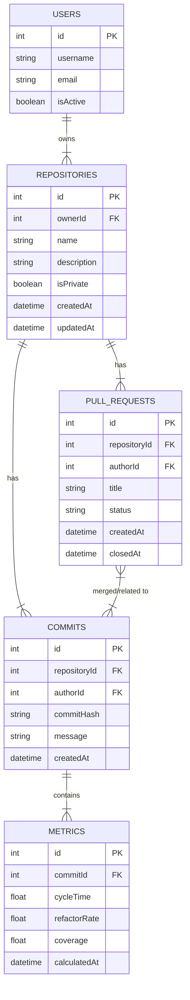

```mermaid
erDiagram
    USERS {
        int id PK
        string username
        string email
        boolean isActive
    }
    
    REPOSITORIES {
        int id PK
        int ownerId FK
        string name
        string description
        boolean isPrivate
        datetime createdAt
        datetime updatedAt
    }
    
    COMMITS {
        int id PK
        int repositoryId FK
        int authorId FK
        string commitHash
        string message
        datetime createdAt
    }
    
    PULL_REQUESTS {
        int id PK
        int repositoryId FK
        int authorId FK
        string title
        string status
        datetime createdAt
        datetime closedAt
    }

    METRICS {
        int id PK
        int commitId FK
        float cycleTime
        float refactorRate
        float coverage
        datetime calculatedAt
    }

    USERS ||--|{ REPOSITORIES : "owns"
    REPOSITORIES ||--|{ COMMITS : "has"
    REPOSITORIES ||--|{ PULL_REQUESTS : "has"
    COMMITS ||--|{ METRICS : "contains"
    PULL_REQUESTS }|--|{ COMMITS : "merged/related to"
```